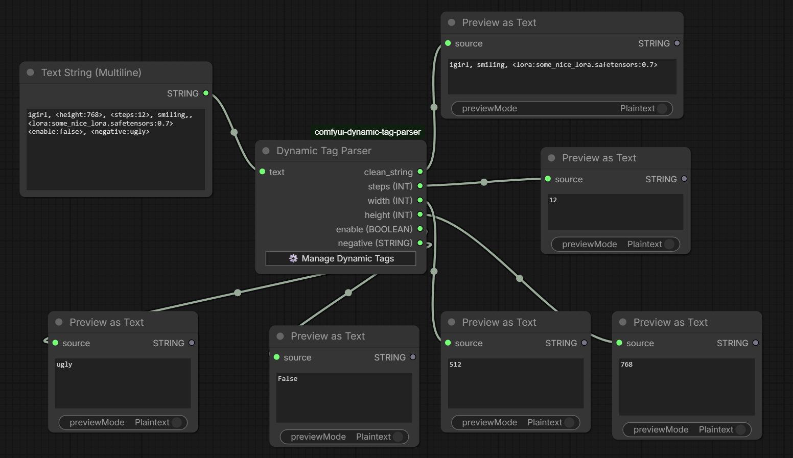
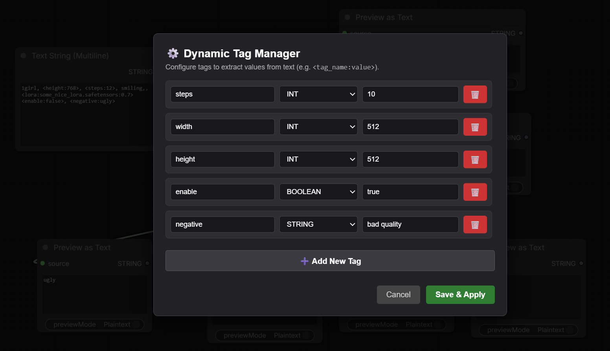

# Dynamic Tag Parser for ComfyUI

<p align="center">
  
  
</p>

Extract parameter tags (e.g., `<width:1024>`, `<cfg:7.5>`) directly from prompt text into node output slots.

## ⚡ Quick Example

**Input Text:**

> `a photo of a cat, <width:1024>, <cfg:7.5>, <boost:true>`

**Outputs:**

* `clean_string` $\rightarrow$ `"a photo of a cat"`
* `width` (INT) $\rightarrow$ `1024`
* `cfg` (FLOAT) $\rightarrow$ `7.5`
* `boost` (BOOLEAN) $\rightarrow$ `True`


## 🚀 How to Use

1. **Add Node**: Right-click in ComfyUI and search for **Dynamic Tag Parser** (under `utils/text`).
2. **Open Manager**: Click **`⚙️ Manage Dynamic Tags`** on the node.
3. **Configure Outputs**:
    * **Tag Name**: The word inside the tag (e.g. `width` for `<width:1024>`).
    * **Type**: Choose `INT`, `FLOAT`, `STRING`, or `BOOLEAN`.
    * **Default**: Value returned if the tag isn't found in the input text.
4. **Save**: Click **Save & Apply**. Your output slots will update on the node.
5. **Connect**: Link `clean_string` to your text encoder and output sockets to your other nodes inputs.


## 📦 Installation

1. Navigate to `ComfyUI/custom_nodes/`
2. Clone this repo:
```bash
git clone https://github.com/j0n4t/comfyui-dynamic-tag-parser.git
```
3. Restart ComfyUI.